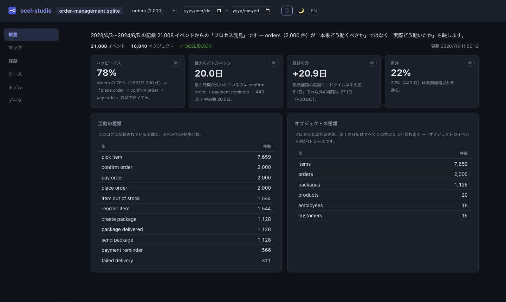

# ocel-studio

Local-first process mining studio for [OCEL 2.0](https://www.ocel-standard.org/) event logs.

Open an OCEL 2.0 file (SQLite / JSON / XML) and discover your processes: insight
cards in plain language, a frequency-and-wait process map, trace variants with
measured lead times, inductive-miner models — and drill from every number down
to the real cases behind it. Without sending your event data anywhere.



## Status

The discovery loop is complete: one screen per question (overview / map / paths /
cases / model / data), a global carried context (object type, time range), and
every claim lands on real cases within two clicks. The log live-reloads when the
file changes on disk, so an incrementally synced log behaves like a living
dashboard. Data-source management (connector orchestration) is the next phase.
Design decisions are recorded in [docs/adr](docs/adr/).

## Quickstart

```sh
pnpm --dir frontend install
pnpm --dir frontend build          # embedded into the binary at compile time
cargo run --release
# → ocel-studio running at http://127.0.0.1:6235/
```

No log yet? The studio starts empty and offers to fetch the official
[Order Management](https://zenodo.org/records/18373906) sample (21K events,
~35 MB) into its data directory with one click — it reopens the most recent
log there on the next start. To open your own file:

```sh
cargo run --release -- path/to/log.sqlite   # .json / .sqlite / .xml
```

## The ocel family

| Layer | Repo | License |
|---|---|---|
| Core model, I/O, validation | [ocel-rs](https://github.com/katsut/ocel-rs) (crates.io: [`ocel`](https://crates.io/crates/ocel)) | MIT |
| ETL engine (StagingLog → OCEL) | [ocel-etl](https://github.com/katsut/ocel-etl) | MIT |
| Backlog connector | [ocel-etl-backlog](https://github.com/katsut/ocel-etl-backlog) | MIT |
| Analysis library (variants / OC-DFG / metrics) | ocel-mine (planned) | MIT |
| **Studio — UI + data source management (this repo)** | ocel-studio | **Elastic License 2.0** |

The studio never links connectors: it orchestrates them as child processes and reads
the OCEL 2.0 files they produce, so any tool that writes OCEL 2.0 works as a source.

## License

[Elastic License 2.0](LICENSE.txt) — free to use, copy, modify, and distribute,
including commercial and internal business use. The one thing you may not do is
provide ocel-studio itself to third parties as a hosted or managed service.
ELv2 is source-available, not an OSI-approved open source license; the library
layer of the ocel family is plain MIT.
